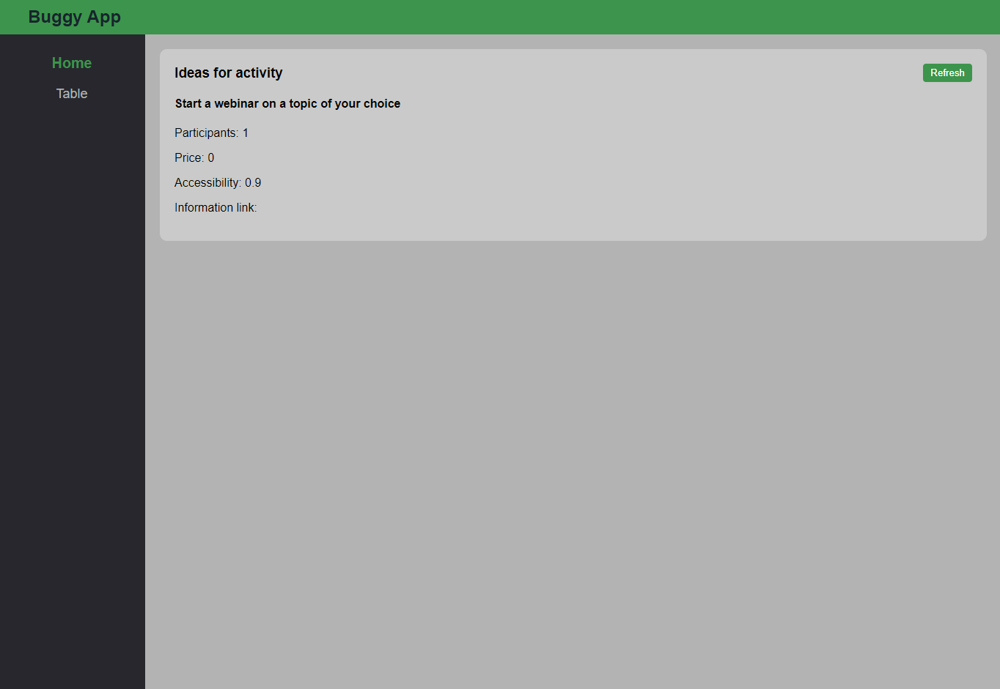
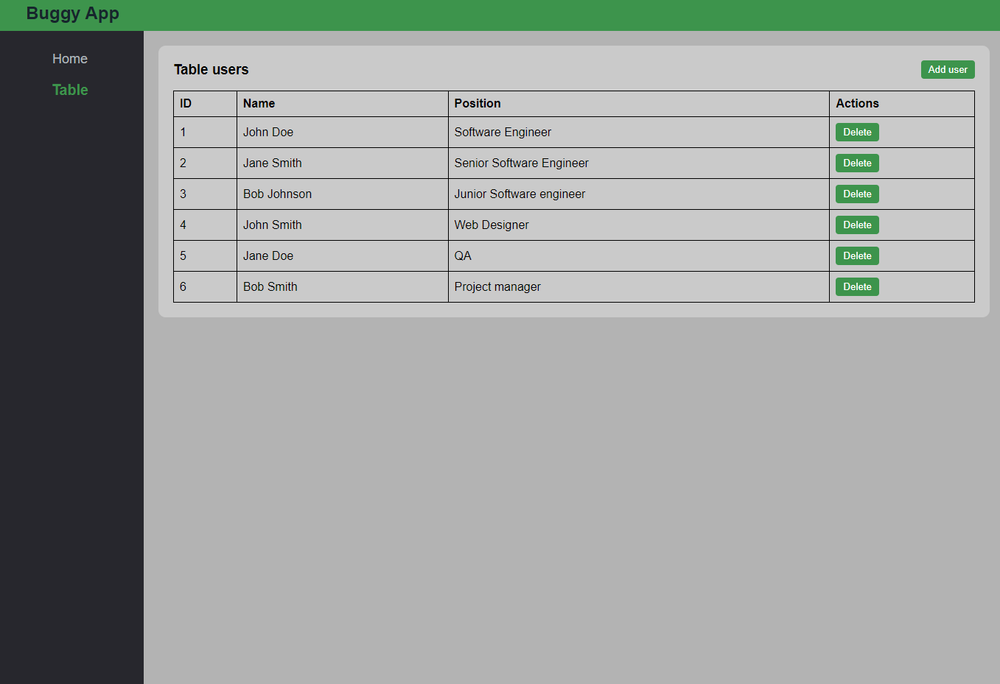

## Buggy App

This is a simple Vue 3 dashboard designed to assess the skills of junior Vue 3 developers.

The app contains the following pages:

* **Home Page** : This page makes an API request to a remote server ([https://www.boredapi.com/api/activity](https://www.boredapi.com/api/activity)).
  
* **Table Page** : This page features a simple table with action buttons, utilizing a Pinia store.

The app is built using Vitest, Pinia, Vite, Vue Router, TypeScript, and the Composition API.

#### Main Tasks for Participants:

FInd and fix bugs (version with bugs is on branch 'dashboard-with-bugs')

* [ ] refresh button on home page doesn't works
* [ ] New user form's data isn't cleaned after closing modal
* [ ] Delete user button doesnt works

**Home Page**

* [ ] Parse the activity data and convert it into human-friendly names.
* [ ] Implement a condition to display a link only when a link is present in the data.

**Table Page**

* [ ] Add validation for adding a new user (validation for both name and position fields).
* [ ] Replace the manual input field for job positions with a select dropdown.
* [ ] Add 'edit user' button

**Testing**

* [ ] Write unit tests (vitest) for the newly created functions.

## Project Setup

```sh
npm install
```

### Compile and Hot-Reload for Development

```sh
npm run dev
```

### Type-Check, Compile and Minify for Production

```sh
npm run build
```

### Run Unit Tests with [Vitest](https://vitest.dev/)

```sh
npm run test:unit
```

### Run End-to-End Tests with [Cypress](https://www.cypress.io/)

```sh
npm run test:e2e:dev
```

### Author

Sergej Mueller
